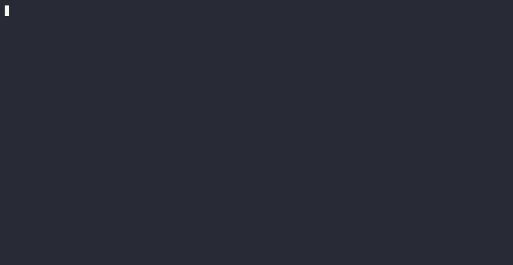

# Isolated sidebar demonstration

21/09/2026 — synthetic fixtures only, no existing session captured or modified.



[MP4](assets/sidebar.mp4) · [Poster](assets/sidebar-poster.png)

## Reproduce

```sh
nix build --no-link --print-out-paths
python docs/record-demo.py /absolute/build/lib/zellij-vertical-tabs.wasm new-capture
python docs/check-demo.py new-capture
nix shell nixpkgs#asciinema-agg --command agg --font-family 'DejaVu Sans Mono,Noto Color Emoji' --font-size 18 --theme dracula new-capture/zellij-demo.cast demo.gif
ffmpeg -threads 0 -ss 4 -i demo.gif -t 19 -c:v libx264 -pix_fmt yuv420p demo.mp4
ffmpeg -ss 10 -i demo.gif -frames:v 1 poster.png
```

WASM used: `/nix/store/m4a24pmhzgsk3w8sd2ic21386r1iqzgv-zellij-vertical-tabs-0.1.0/lib/zellij-vertical-tabs.wasm`.
Runtime: installed Zellij 0.44.3. Build/source/runtime/helper hashes and launch argv:
`evidence/demo-final/metadata.json`; source tree identity: `evidence/provenance.txt`.
Actual tab names, pane state, layout, permission fixture, four active-tab queries,
plugin-written manifests and original cast are alongside it. The regression
oracle rejects the earlier default-layout captures (missing validated artifacts).

## Root cause

The fresh HOME had no Zellij config directory. In 0.44.3 the server file-layout
loader resolves via a config/layout directory; when absent it falls back to the
built-in layout. Changing attach/new-session flags alone did not help. An explicit
existing private `--config-dir` fixed the same requested layout. Upstream reference:
`zellij-utils/src/input/{cli_assets,layout}.rs` at tag `v0.44.3`.

The sidebar calls `set_selectable(false)`, so typing `y` reached the synthetic
shell instead of granting its permission prompt. The helper pre-authorizes only
the exact WASM path's two requested permissions in a throwaway cache. No live
permission/config change. It polls exact names and a real plugin manifest before
the presentation interval, validates every active switch, and decodes split UTF-8
incrementally. No attach path; private HOME/XDG/socket directory/PTY/environment.

## Media provenance

Actual PTY output rendered by agg 1.9.0, DejaVu Sans Mono + Noto Color Emoji;
no hand-drawn output, stock footage, music, audio or real account data. GIF is
full-speed raw capture including startup/exit; MP4 requests a 19-second trim
(measured 18.802817 seconds) without speeding playback. Poster at 10 seconds shows Sample 13; scroll frame at
15 seconds shows Sample 26 and overflow. Fonts are renderer dependencies, not
bundled font files. Assets are under 1 MiB each. See the canonical swarm report
for remaining independent-review/CI/merge gates.

Earlier R6 staged failure evidence is retained unchanged under `evidence/failed-*`
and `evidence/recording-2026-09-21`; it is NOT demo media. R8 diagnostic trials
remain separately named. The initial `r8-config-dir` cast passed names but still
showed the permission prompt; only `demo-final` is the final capture receipt.
